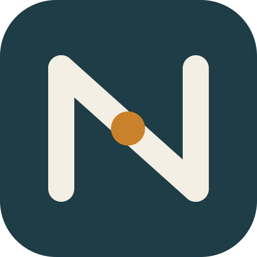
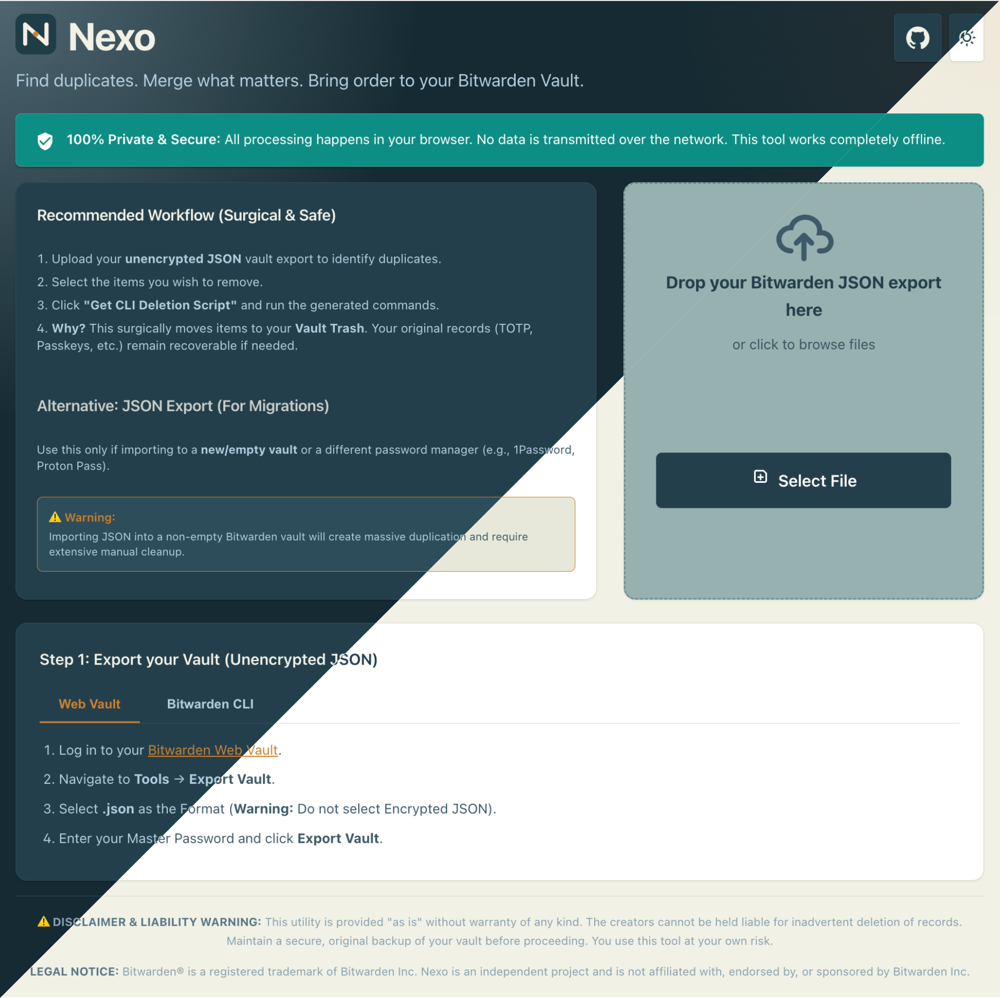

  

<h1 align="center">Nexo</h1>

Find duplicates. Merge what matters. Bring order to your Bitwarden Vault. 

  

Demo prepared with <a href="https://tight.studio/">Tight Studio</a>

A secure, offline-first utility for analyzing duplicate entries in Bitwarden vault exports.

## 🔒 Security & Privacy Guarantees

- **100% Offline**: Works completely offline in airgapped environments.
- **Zero External Dependencies**: Single HTML file with zero remote calls (no CDNs, no fonts).
- **Weighted Duplicate Intelligence**: Matching logic that distinguishes stubs from complete records.
- **Burned Teal UI**: High-density, professional interface designed for 10,000+ records.

## ✨ Key Features

### 🧬 Review & Merge (Record Synthesis)
Identify items with identical credentials but unique data (TOTP, Notes, Custom Fields). Synthesize them into a single **Union Record** and automatically move originals to the Trash.

### 🔍 Differential Highlighting (≠)
Instantly see exactly where records differ. Divergent fields are highlighted with **wavy underlines** and bolding, accompanied by the divergence (≠) icon.

### ⚠️ Conflict & SSO Protection
Prevents accidental data loss by flagging password mismatches as "Conflicts" and preventing auto-selection on SSO-tagged accounts.

## 🚀 Recommended Workflows

### 1. Surgical Cleaning (Safe & Recoverable)
The most robust way to clean your vault:
1. **Analyze**: Upload your unencrypted JSON to identify duplicates.
2. **Review & Merge**: Synthesize complementary records into the `[ MERGED ]` folder.
3. **CLI Delete**: Use **"Get CLI Deletion Script"** to move items to your **Vault Trash**.
4. **Safety**: Items in Trash can be recovered within 30 days if needed.

### 2. Seamless Migration (Cross-Manager)
Use the **"Download JSON"** export if migrating to a **new/empty vault** or a different manager like 1Password or Proton Pass.

## ⚠️ Disclaimer & Liability Warning

This utility is provided "as is" without warranty of any kind. The creators cannot be held liable for inadvertent deletion of your records. **Always maintain a secure, original backup of your Bitwarden vault before using this tool.** You use this utility at your own risk.

## Legal Notice

Bitwarden® is a registered trademark of Bitwarden Inc. Nexo is an independent project and is not affiliated with, endorsed by, or sponsored by Bitwarden Inc.

---

### Shortcuts
- <kbd>Ctrl/Cmd</kbd> + <kbd>O</kbd>: Open Vault File
- <kbd>Ctrl/Cmd</kbd> + <kbd>S</kbd>: Export Cleaned JSON
- <kbd>Esc</kbd>: Close Modals

---

Made for Bitwarden power users who want local-first cleanup.
